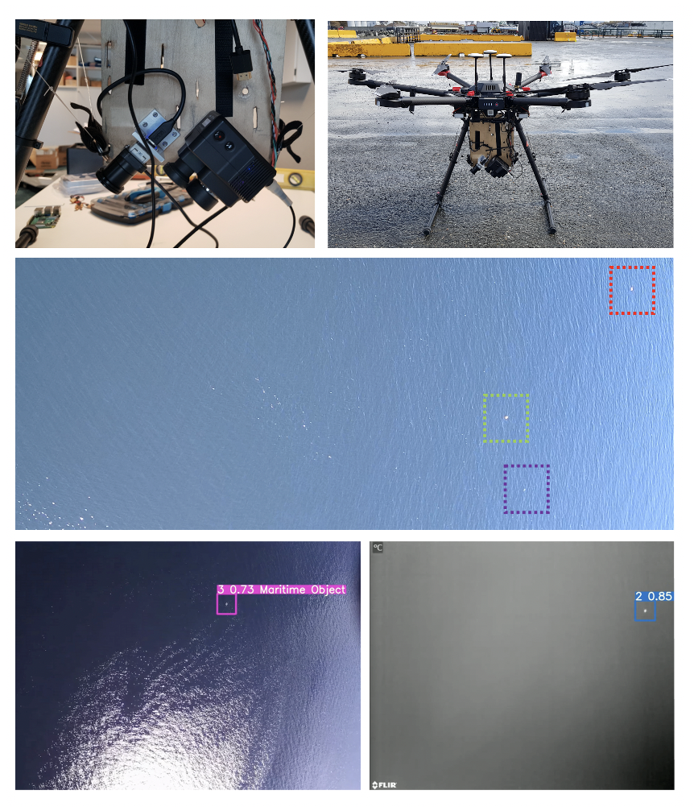

# Object detection, classification, and recognition in UAVs: A machine learning approach
### Public repository for TTK4550 - Specialization Project - Fall 2020

A notebook is added for almost each tiral in the results. Consequently, many are quite similar.
The notebooks are based on the Computer Vision Model Library from Roboflow.com

Due to the size of the model weights, they are not added in the repository.

## Abstract
*This project shows the performance of state-of-the-art object detection architectures on both thermal and visual data of objects at sea, captured by an UAV.
Experiments prove that by introducing a tracking algorithm, a performance
similar to a low-pass filter of detections appear, thus enabling a decrease in
confidence threshold without significant drops in recall. Consequently, this
results in the ability to decrease the amount of false negatives without affecting the amount of false positives noteworthy. In addition, a study about the
complementary information provided by thermal and visual modalities shows
that thermal imaging provides a significant improvement in object detection
in situations that includes glare. Moreover, a fusion strategy to fuse the modalities are presented. Finally, an introduction to how a machine learning system
may be implemented in a maritime setting shows that the incorporation of an
operator in a continual learning system seems feasible.*

